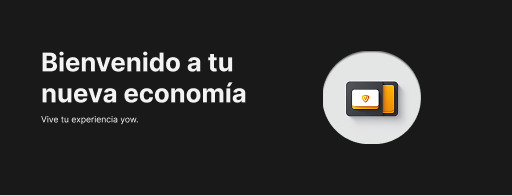

# Your Online Wallet (YOW)

[](https://github.com/Pablo-r-stack/Your-Online-Wallet/stargazers)
[](https://github.com/Pablo-r-stack/Your-Online-Wallet/issues)
[](https://github.com/Pablo-r-stack/Your-Online-Wallet)
[](https://github.com/Pablo-r-stack/Your-Online-Wallet)
[](https://www.figma.com/design/OER4zN4FbHUT4gT0oYJRUj/YOW?node-id=0-1&p=f&t=Ce7Yb0Lb0nL8GXgI-0)


**YOW** es una aplicación web de billetera digital que permite a los usuarios mayores de 18 años realizar pagos en línea, transferencias entre cuentas, ingresar dinero desde tarjetas de crédito o débito y visualizar el historial de movimientos, todo a través de una interfaz intuitiva y segura.



---

## ☕ Acerca de:

Este proyecto fue desarrollado en el marco del programa de simulaciones laborales de **No Country**, con fines educativos y de práctica en un entorno cooperativo similar al laboral.

---

## 🚀 Funcionalidades

- **Registro y Autenticación**: Sistema de registro y login con autenticación JWT.
- **Pagos en Línea**: Realiza pagos de servicios de forma rápida y segura.
- **Transferencias**: Envía dinero de una cuenta a otra dentro de la plataforma.
- **Ingreso de Dinero**: Añade fondos desde tarjetas de crédito o débito.
- **Historial de Movimientos**: Visualiza todas tus transacciones realizadas.
- **Diseño Responsivo**: Interfaz adaptada para dispositivos desktop y móviles.
- **Seguridad Básica**: Protección de la información del usuario mediante buenas prácticas de seguridad.

---

## 🛠️ Tecnologías Utilizadas

### Backend

[](https://www.java.com/)
[](https://spring.io/projects/spring-boot)
[](https://www.mysql.com/)
[](https://www.postman.com/)
[](https://jwt.io/)
[]()
[]()


- **Java** con **Spring Boot**
- **MySQL** como base de datos relacional
- **Postman** para pruebas de API
- **JWT** para autenticación y autorización
- **Arquitectura MVC** y **API RESTful**

### Frontend


[](https://developer.mozilla.org/en-US/docs/Web/JavaScript)
[](https://reactjs.org/)
[](https://vitejs.dev/)
[](https://tailwindcss.com/)
[](https://figma.com/)

- **JavaScript** con **React**
- **TailwindCSS** para estilos rápidos y responsivos
- **Figma** para diseño UI/UX

---

## 🧑‍💻 Equipo de Desarrollo

**Comisión**: C16-48-N-JAVA

- **Team Leader**: Alejandro Domínguez
- **Backend Developers**:
  - Juan Daniel Pacheco Pérez
  - José Miguel Ramírez González
- **Frontend Developers**:
  - Facundo Rubén Medina
  - Pablo Ramiro Velasco (FRONTEND DEV / UI/UX / PM)

---

## ⚙️ Instalación y Uso

1. **Clona el repositorio**:

   ```bash
   git clone https://github.com/Pablo-r-stack/Your-Online-Wallet.git

2. **Backend**:

   - Navega al directorio del backend:

     ```bash
     cd Your-Online-Wallet/backend
     ```

   - Configura la base de datos MySQL y ajusta las credenciales en el archivo `application.properties`.

   - Ejecuta la aplicación con Maven:

     ```bash
     mvn spring-boot:run
     ```

3. **Frontend**:

   - Navega al directorio del frontend:

     ```bash
     cd Your-Online-Wallet/frontend
     ```

   - Instala las dependencias:

     ```bash
     npm install
     ```

   - Configurar API URL (src/auth/constans) -> puedes reemplazar esto por un .env:

     ```
     export const API_URL= 'http://localhost:8080'
     ```

   - Inicia la aplicación:

     ```bash
     npm run dev
     ```

4. **Accede a la aplicación**:

   - Abre tu navegador y visita `http://localhost:3000` para interactuar con la interfaz de usuario.